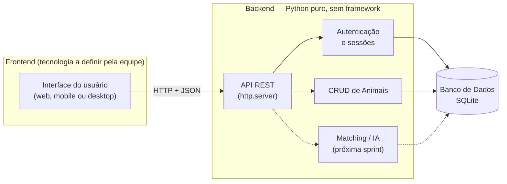

# Arquitetura do Sistema — PetCerto

## Visão geral

O PetCerto é dividido em duas partes que se comunicam por rede, e não por
estarem coladas no mesmo programa:

- **Backend** (esta responsabilidade): guarda os dados, aplica as regras de
  negócio e expõe tudo através de uma **API REST** (endereços HTTP que
  recebem e devolvem JSON).
- **Frontend** (responsabilidade de outro(s) integrante(s) da equipe):
  qualquer interface — site, app mobile, app desktop — que **consome** essa
  API. Ainda não foi decidida a tecnologia do frontend, e isso não afeta o
  backend: ele não sabe nem precisa saber quem está do outro lado, só
  entende requisições HTTP.

## Por que uma API REST, e não um app único (Tkinter, por exemplo)

Como o projeto é feito em equipe e o frontend ainda não tem tecnologia
definida, o backend não pode depender de uma interface específica. Expondo
os dados e as regras via HTTP/JSON, qualquer frontend — React, Flutter,
outro programa Python, até uma ferramenta de teste como Postman — consegue
usar o sistema, sem precisar mexer em uma linha do backend.

## Camadas do backend

| Camada | Pasta | Responsabilidade |
|---|---|---|
| API | `backend/api/` | Recebe requisições HTTP, converte JSON ↔ objetos Python, aplica controle de acesso por perfil, devolve respostas |
| Autenticação | `backend/auth/` | Login, cadastro de usuário, hashing de senha, gerenciamento de sessões (tokens) |
| Regras de negócio / dados | `backend/database/` | CRUD da entidade Animal, conexão com o banco, schema |
| Modelos | `backend/models/` | Representação das entidades (Usuário, Animal) como classes Python |
| Matching (futuro) | `backend/matching/` | Algoritmo de compatibilidade adotante-animal — componente computacional avançado do projeto (Sprint seguinte) |

## Tecnologias

- **Linguagem:** Python 3 (biblioteca padrão apenas — sem Flask, FastAPI, Django)
- **Protocolo:** HTTP, com corpo em JSON
- **Banco de dados:** SQLite nesta sprint. A escolha final (PostgreSQL, MySQL etc.) cabe à equipe; a troca afeta só `backend/database/db.py`, o resto do backend não muda.
- **Autenticação:** hash de senha SHA-256 + salt, sessão via token aleatório enviado no cabeçalho `Authorization`

## Fluxo de uma requisição autenticada (exemplo: criar um animal)

1. Frontend faz `POST /api/auth/login` com e-mail e senha → recebe um `token`.
2. Frontend guarda esse token (localStorage, variável de estado, etc. — decisão do frontend).
3. Frontend faz `POST /api/animais` enviando os dados do animal no corpo e o cabeçalho `Authorization: Bearer <token>`.
4. Backend valida o token, verifica se o perfil do usuário pode criar animais, valida os dados e grava no banco.
5. Backend devolve o animal criado (com `id` gerado) em JSON.

Detalhes de todas as rotas: [`docs/api.md`](api.md).
