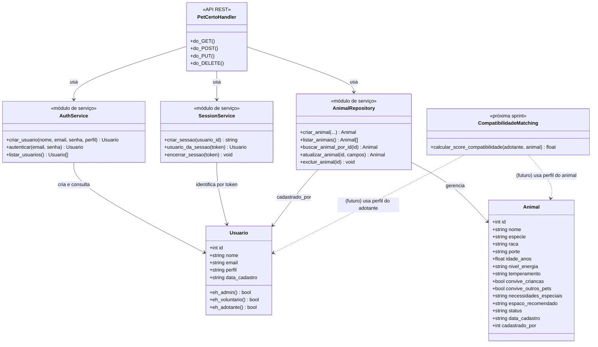

# Diagrama de Classes — PetCerto

> Renderiza automaticamente no GitHub (é um diagrama Mermaid dentro do Markdown).

## Observação sobre as classes de serviço

`AuthService`, `SessionService`, `AnimalRepository` e `PetCertoHandler` estão
representados como classes para fins do diagrama, mas no código são módulos
Python com funções (não classes tradicionais com `self`) — uma escolha
comum em backends simples, que não perde nada em termos de organização ou
regras de negócio. As entidades de dados de verdade (o que vai para o banco)
são `Usuario` e `Animal`.
