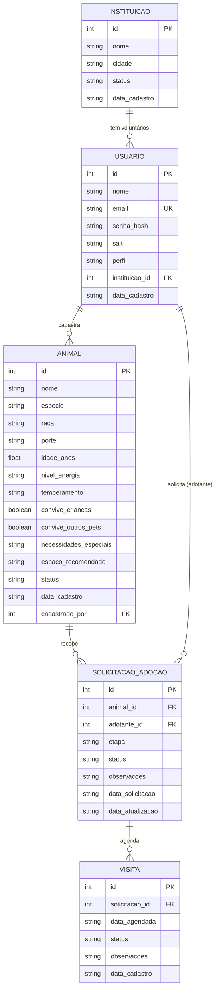

# Modelo Entidade-Relacionamento (MER) — PetCerto

> Renderiza automaticamente no GitHub (é um diagrama Mermaid dentro do Markdown).

## Entidades

### Instituição
ONG ou abrigo. Criada automaticamente quando um usuário se cadastra como
`voluntario` informando o nome da instituição (autocadastro), ou por um
administrador.

### Usuário
Representa qualquer pessoa com acesso ao sistema — administrador, voluntário
(vinculado a uma instituição) ou adotante. O **perfil** é o que define o que
cada um pode fazer (ver `docs/arquitetura.md`).

### Animal
Cadastrado por um usuário (voluntário de uma instituição, ou admin). Guarda
as características usadas tanto para exibição quanto para o algoritmo de
compatibilidade (porte, energia, convivência com crianças e outros pets,
espaço recomendado).

### Solicitação de Adoção
Representa o pedido de um adotante por um animal específico, com um fluxo de
etapas (`interesse` → `analise` → `visita` → `documentos` → `aprovacao` →
`concluida`) e um status (`em_andamento`, `aprovada`, `recusada`, `cancelada`).

### Visita
Um agendamento vinculado a uma solicitação de adoção específica — parte do
processo de avaliação antes da aprovação final.

## Relacionamentos

- Uma **Instituição** tem vários **Usuários** (voluntários) — 1:N, via `usuarios.instituicao_id`
- Um **Usuário** pode cadastrar vários **Animais** — 1:N, via `animais.cadastrado_por`
- Um **Animal** pode receber várias **Solicitações de Adoção** ao longo do tempo (uma por vez em andamento) — 1:N, via `solicitacoes_adocao.animal_id`
- Um **Usuário** (adotante) pode fazer várias **Solicitações de Adoção** — 1:N, via `solicitacoes_adocao.adotante_id`
- Uma **Solicitação de Adoção** pode ter várias **Visitas** agendadas — 1:N, via `visitas.solicitacao_id`

## Regras de negócio refletidas no modelo

- Um animal só recebe uma nova solicitação se estiver com status `disponivel`; ao receber uma, vira `em_processo` automaticamente
- Aprovar uma solicitação marca o animal como `adotado`; recusar/cancelar devolve para `disponivel` (se não houver outra solicitação ativa)
- A etapa de uma solicitação só avança, nunca retrocede
- Um voluntário só gerencia solicitações de animais cadastrados por alguém da própria instituição (isolamento entre ONGs)
