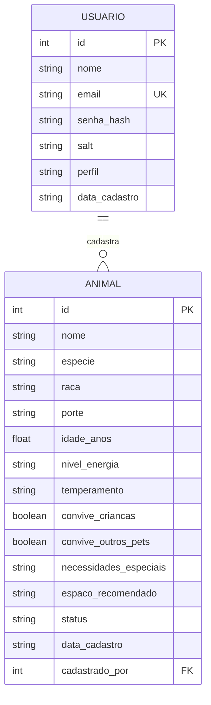

# Modelo Entidade-Relacionamento (MER) — PetCerto

> Renderiza automaticamente no GitHub (é um diagrama Mermaid dentro do Markdown).

## Entidades

### Usuário
Representa qualquer pessoa com acesso ao sistema — administrador do abrigo,
voluntário ou adotante. O **perfil** é o que define o que cada um pode
fazer (ver `docs/arquitetura.md`).

### Animal
Entidade principal do sistema nesta fase do projeto. Guarda as
características usadas tanto para exibição quanto, futuramente, para o
algoritmo de compatibilidade (porte, energia, convivência com crianças e
outros pets, espaço recomendado).

## Relacionamento

Um **Usuário** pode cadastrar vários **Animais** (relação 1 : N), registrado
pelo campo `cadastrado_por` em `Animal`, que aponta para o `id` do usuário
responsável pelo cadastro. Um animal só pode ter sido cadastrado por um
usuário (ou nenhum, se `cadastrado_por` for nulo).

Relacionamentos futuros previstos (próximas sprints, quando o fluxo de
adoção for implementado): `Usuario` (adotante) ↔ `Animal`, via uma nova
entidade `Solicitacao_Adocao`, representando o processo de interesse →
avaliação → aprovação → adoção.
